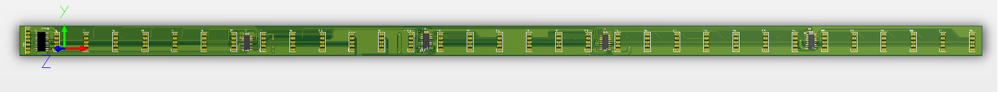

# led-rgb-audio-spectrum
This application using [FFT library](http://www.embeddedsignals.com/ARM.htm) for ARM cortex-M3 to analyze audio and display on RGB LED

#demonstration:
[](https://youtu.be/YXznM0IRcUU)

#installations
1. Hardware Diagram: ```audio-spectrum-hardware\dv_spectrum_corel```


Row board: ```audio-spectrum-hardware\dv_spectrum_row```


Column board: ```audio-spectrum-hardware\dv_spectrum_col```


Main board: ```audio-spectrum-hardware\dv_spectrum_main```


2. Firmware
```c
git clone --recursive https://github.com/tuanpmt/led-rgb-audio-spectrum.git
```

and open with Keil C
